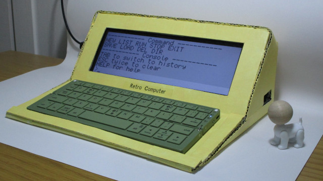
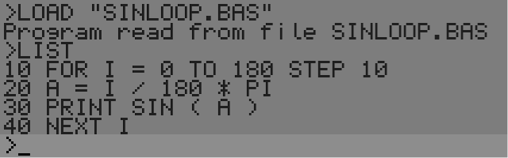
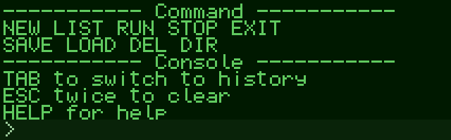

# RetroComputer
Inspired by some retro computer projects, I made this Retro Computer. The Basic intepreter is programmed by [richpl](https://github.com/richpl/PyBasic).

## Parts
* Raspberry Pi 4b
* 7.9 inch (1280x400) capacitive touch screen
* bluetooth wireless keyboard

## Functions
* a command line console
* Basic intepreter

## Dependence
* Pygame

## Running method
```
python main.py
```





## Configuration
You could show or hide the mouse cursor, and choose between two color themes in [config.ini](config.ini):
```
show_cursor = 0
;theme_name = GreenCRT
theme_name = GreyLCD
```

## Console Operation
Console is divided into two parts: the bottom is one line command line, the above is 7 lines history messages list.
* TAB: switch between command line and history messages list
* ESC twice: clear command line
* HELP: display help information
* Up, Down, Left, Right, Page Up, Page Down, Home, End could be used in command line and history messages list

## Console Functions
* NEW: clear current Basic program
* LIST: list current Basic program
* RUN: run current Basic program
* STOP: stop current Basic program, it's useful when the Basic program is in infinite loop
* EXIT: quit console
* SAVE: save current Basic program, the file name should be inside double quotation marks, the file is saved under "BASIC" folder
* LOAD: load Basic program, the file name should be inside double quotation marks
* DIR: list all saved Basic programs under "BASIC" folder

## Basic Intepreter and Usage
Please refer to this reposite: [PyBasic](https://github.com/richpl/PyBasic)

